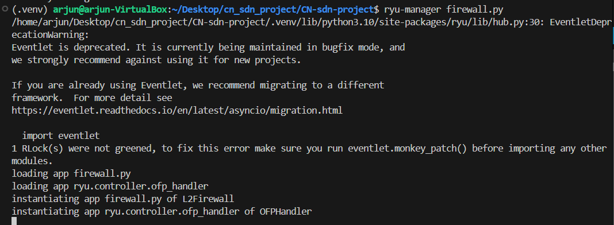
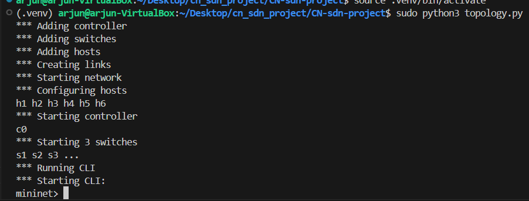
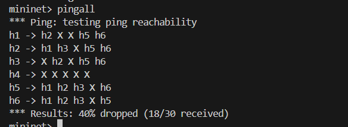
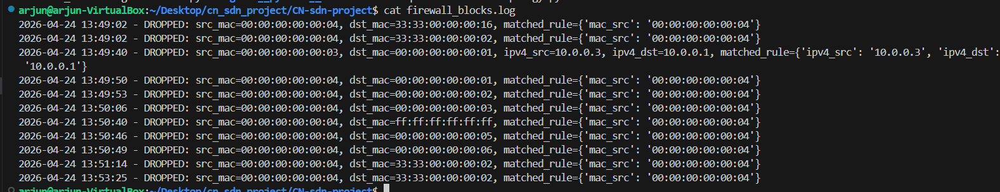
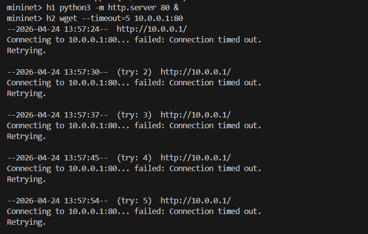
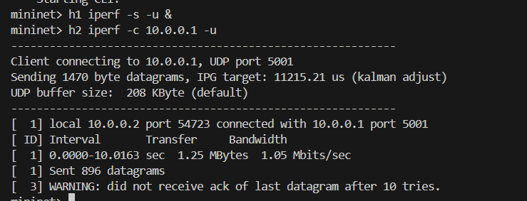

# SDN Controller-Based Firewall

**Name:** Arjun G Kanagal  
**SRN:** PES1UG24CS922

## Project Overview
This project implements a Software-Defined Networking (SDN) Controller-Based Firewall using the **Ryu SDN Framework** and **Mininet**. 

The firewall acts as a Layer 2 learning switch with an integrated traffic interception module. It parses incoming packets (Ethernet, IPv4, TCP, UDP components) and filters them against a predefined set of rules. Disallowed traffic is permanently dropped at the Open vSwitch (OVS) level via dynamically injected OpenFlow `FlowMod` rules, while legitimate traffic is efficiently forwarded.

## Network Topology
The custom network topology consists of a 3-switch hierarchy with 6 hosts:
- **s1**: Main Root Switch
- **s2**: Edge Switch (connected to s1)
  - `h1` (10.0.0.1)
  - `h2` (10.0.0.2)
  - `h3` (10.0.0.3)
- **s3**: Edge Switch (connected to s1)
  - `h4` (10.0.0.4)
  - `h5` (10.0.0.5)
  - `h6` (10.0.0.6)

```text
               +--------+
               |   c0   |  (Remote Ryu Controller: 127.0.0.1:6653)
               +--------+
                   |
                   | (OpenFlow 1.3)
                   |
              [Switch s1]  (Root Switch)
              /         \
             /           \
            /             \
      [Switch s2]       [Switch s3]
       /  |  \           /  |  \
      /   |   \         /   |   \
     /    |    \       /    |    \
   h1    h2    h3    h4    h5    h6
```

## Configured Firewall Rules
The firewall enforces the following access controls:
1. **MAC Address Block:** Completely blocks any ingress or egress traffic from host `h4` (`00:00:00:00:00:04`).
2. **IPv4 Block:** Drops any IP traffic originating from `h3` (10.0.0.3) destined for `h1` (10.0.0.1). Due to the stateless nature of this L2 firewall, it also effectively drops replies from `h1` to `h3`.
3. **TCP Port Block:** Drops traffic targeting TCP port 80 (HTTP).
4. **UDP Port Block:** Drops traffic targeting UDP port 5001 (Default iperf UDP port).

## Project Structure
- `firewall.py`: The Ryu controller application containing the packet inspection, MAC learning, and OpenFlow `FlowMod` logic.
- `topology.py`: The Mininet script defining the 3-switch, 6-host network and binding it to the Remote Ryu Controller.
- `firewall_blocks.log`: Auto-generated audit log containing records of all proactively dropped packets.

## Execution Instructions

### 1. Start the Ryu Controller
Open a terminal, activate your virtual environment (if applicable), and start the firewall script:
```bash
ryu-manager firewall.py
```


### 2. Start the Mininet Topology
In a new terminal window, start the topology:
```bash
sudo mn -c
sudo python3 topology.py
```


## Testing & Results

### Pingall Connectivity Matrix
To verify the state of the network at a high level, the `pingall` command is executed.
```bash
mininet> pingall
```

**Explanation of Results:** As per our rules, `h4` experiences total packet loss globally, and the `h1` <-> `h3` connection also fails, yielding the expected 40% drop rate (18 out of 30 received).

### Detailed Traffic Drops (Logs)
The firewall's background logging captures the precise rules triggered when traffic is dropped.


### Service Port Blocking
To demonstrate the TCP/UDP blocking capabilities (Ports 80 & 5001):

**TCP Port 80 Block Test (HTTP):**


**UDP Port 5001 Block Test (iPerf):**
